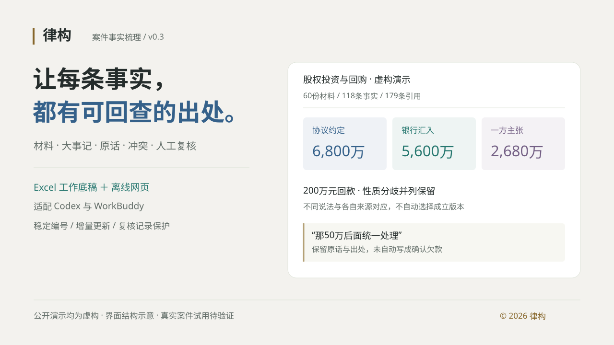

# 律构 · 案件事实梳理



把零散案卷整理成**有出处的事实底稿**。供 Codex 与 WorkBuddy 使用，默认交付七表 Excel、可交互网页与可接续更新的结构化数据。

[项目宣传页](https://zc6503204-collab.github.io/lugou-case-fact-workbench/) · [演示导览](https://zc6503204-collab.github.io/lugou-case-fact-workbench/demo.html) · [在线工作台](https://zc6503204-collab.github.io/lugou-case-fact-workbench/workpaper/案件事实底稿.html#overview) · [获取与使用](https://zc6503204-collab.github.io/lugou-case-fact-workbench/guide.html)

> 公开案卷、公司、人物、交易、材料及合成录音均为**虚构演示**。当前 v0.3 专注事实整理、来源回查和人工复核；真实案件适用效果仍需试用验证。

## 工作方式

材料清点 → 内容识别 → 主体识别 → 事实提取 → 事件关联 → 冲突与缺口检查 → 双格式交付。

- **来源可回查：** 每条事项保留原始时间、涉及主体、行为、金额、材料、准确位置、原话与复核状态。
- **不同说法并列：** 区分材料记载、一方陈述和待核推断；包括不利材料，不自动选择成立版本。
- **人工记录可接续：** Excel 保存状态、备注、金额更正、整理分组与重点选择；回导后重新生成网页快照。
- **增量更新有保护：** 文件内容识别重复与新版本，保持稳定编号；材料变化影响人工记录时列为待确认变更。
- **金额分口径核对：** 协议、流水、回款、财务口径和各方主张分别展示；同笔交易的多份引用不重复汇总。

七个工作表：案件速览、材料目录、主体表、事实大事记、原文与来源、冲突与待核、更新记录。Excel 使用华文仿宋，网页提供沉稳多色、明快彩色与灰金三套配色。

网页以大事记为主要工作区，支持重点视图、人工分组、搜索筛选、详情、关联回查、录音定位及打印全量或当前筛选。网页可以本地打开，无需部署服务；移动带原件的成果时需保留整个文件夹。

## 获取与安装

推荐打开 [复制给 AI 安装](https://zc6503204-collab.github.io/lugou-case-fact-workbench/#ai-install)，选择当前工具、Codex 或 WorkBuddy.app，复制指令后发送给能够读取网址并操作本机文件的 AI。

也可以直接发送下面这段话：

```text
请阅读 https://zc6503204-collab.github.io/lugou-case-fact-workbench/install.md，按其中的安装流程，将“律构·案件事实梳理”安装到当前 AI 工具的个人 Skill 目录。只使用本项目的安装资源并核验文件；已有版本先比较，更新前备份并保留本机配置。完成后检查 Skill 入口和运行支持，告诉我安装结果及还缺哪些依赖。
```

安装助手只安装固定 v0.3 的 Skill 文件并核验下载包；相同文件不重复写入，更新前备份将被覆盖的文件，保留本机配置与新增文件。运行依赖另行检查。详见 [AI 安装说明](docs/install.md) 和 [安装清单](docs/install-manifest.json)。

| 平台 / 内容 | 下载 | 安装位置 |
| --- | --- | --- |
| Codex | [v0.3 安装包](docs/downloads/codex-lugou-v0.3.zip) | `~/.codex/skills/case-fact-structuring/` |
| WorkBuddy.app | [v0.3 安装包](docs/downloads/workbuddy-lugou-v0.3.zip) | `~/.workbuddy/skills/case-fact-structuring/` |
| 虚构材料与成果 | [完整演示包](docs/downloads/fictional-demo-v0.3.zip) | 解压后保留文件夹结构 |
| 工作底稿 | [Excel](docs/workpaper/案件事实底稿.xlsx) / [case.json](docs/workpaper/case.json) | 人工复核与增量更新 |

解压后保留完整 `case-fact-structuring` 文件夹，重新加载平台会话。两平台共享业务规则和脚本，各有平台入口。

Codex 示例：

```text
$case-fact-structuring
请整理指定案件材料目录【填写目录】，案件简称【填写简称】。
先清点并检查读取范围，再逐份阅读提取单元，整理事实、引用、冲突与待核问题。
保留原话、准确出处和不同版本，交付 Excel、离线网页和 case.json。
```

WorkBuddy 示例：

```text
使用律构·案件事实梳理 Skill 整理【材料目录】，案件简称【简称】。
先检查运行支持，逐份整理指定材料，保留来源、分歧与读取缺口，交付双格式底稿。
```

补材料时，提供上一版 `case.json`、已复核 Excel 与新材料目录，先回导人工记录再接续整理。普通空白保留旧值；清除人工字段须显式使用 `--clear-empty`，金额 `0` 和重点“否”均作为有效选择保留。

## 运行基线

当前整体验证基线为 **Apple Silicon Mac**。安装包不含运行库、本机配置或模型权重；其他机器先检查环境。

| 环节 | 运行支持 |
| --- | --- |
| 文档提取 | Python、pypdf、python-docx、openpyxl |
| 扫描 / 图片 OCR | macOS Vision / PDFKit |
| Excel 生成 | Node 与 Codex bundled `@oai/artifact-tool`，使用宿主提供的运行库 |
| 原始录音 | 独立 mlx-whisper 环境、本地模型和 ffmpeg |

`doctor` 仅检查运行支持。参照 [runtime.example.json](case-fact-structuring/runtime.example.json) 配置已有环境；不自动下载模型或上传录音。音频识别可离线运行，材料理解仍由用户所选 Agent 处理。

提取脚本产生目录和阅读单元，**模型仍需理解材料并整理事实**。关键姓名、日期、金额和原话需人工回原件或原录音确认。缺少 OCR 或录音支持时保留具体缺口，继续生成范围明确的阶段底稿。

详见 [Skill 入口](case-fact-structuring/SKILL.md)、[平台说明](case-fact-structuring/references/platforms.md)、[运行说明](case-fact-structuring/references/runtime.md) 与 [数据格式](case-fact-structuring/references/data-format.md)。

## 虚构复杂案卷

60份材料、118条事实、179条引用、21项问题，跨约30个月。协议、资金、财务、聊天、邮件、通知、程序材料与4段合成录音交叉出现，包含重复件、异常材料及缺损批次。

| 金额口径 | 数值 | 含义 |
| --- | ---: | --- |
| 两轮协议约定 | 6,800万元 | 第一轮4,800万元 + 第二轮2,000万元 |
| 银行汇入记录 | 5,600万元 | 六笔汇入记录；单独核对性质 |
| 甲方最新主张 | 2,680万元 | 本金2,400万元 + 自算收益250万元 + 费用30万元 |

200万元回款的性质分歧保留并列来源。“那50万后面统一处理”保留原话，未转为确认欠款。同名主体与缺失附件分别暴露。12条重点和6个人工分组只示范整理方式，不表示已核对原件。

## 测试与限制

发布版附可重复执行的来源、文件、Excel 和网页逻辑检查，包括500条事项检索、三套主题及存储失败场景。具体通过项目与待验证项目见 [TESTING.md](TESTING.md)。

原工作台的桌面、375px手机、A4实际视觉验收仍待本机确认；逻辑测试不能替代视觉检查。真实案件试用、真实录音准确率和独立听核尚未完成。法律定性、证据采信、诉讼策略、Word及独立PDF不属于本版范围。

## 项目结构

```text
case-fact-structuring/   业务规则、统一数据模板、提取及导出脚本
docs/                   宣传首页、演示导览、使用页与虚构成果
tests/                  网页逻辑检查
tools/                  宣传页生成、公开发布检查
                        AI 安装助手与安装指引生成
NOTICE.md               使用授权
TESTING.md              验证范围与未完成项
PROMOTION.md             可复用的项目介绍与分享文案
```

公开发布通过独立目录管理，不携带真实案卷、本机配置、运行环境或历史备份。反馈请使用虚构或去标识化材料：[GitHub Issues](https://github.com/zc6503204-collab/lugou-case-fact-workbench/issues)。

## 使用授权

© 2026 律构。保留权利。项目当前**未附开源许可证**，公开源代码供展示与评估，其他使用授权请联系维护者。第三方依赖和模型遵循各自授权。详见 [NOTICE.md](NOTICE.md)。
